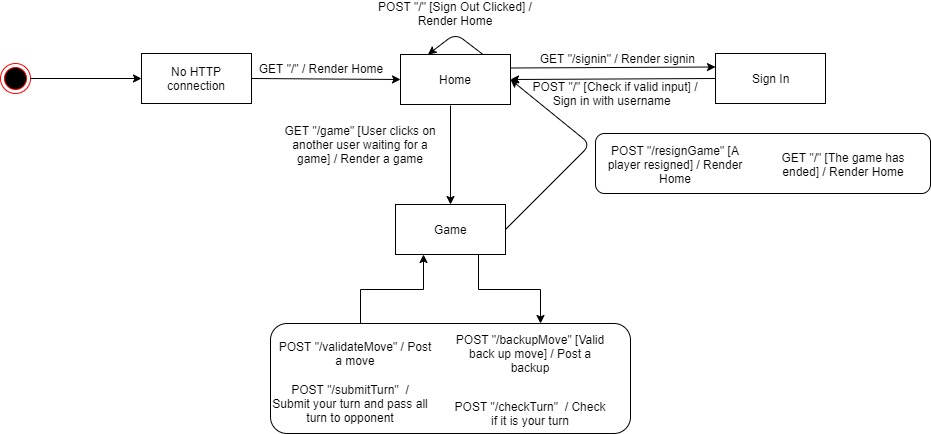
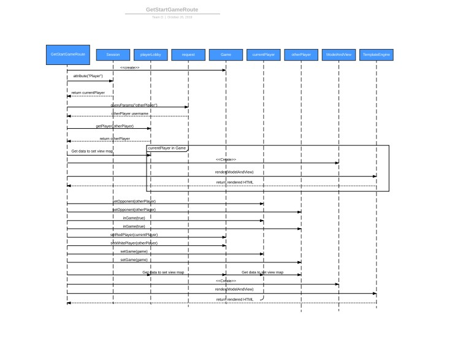
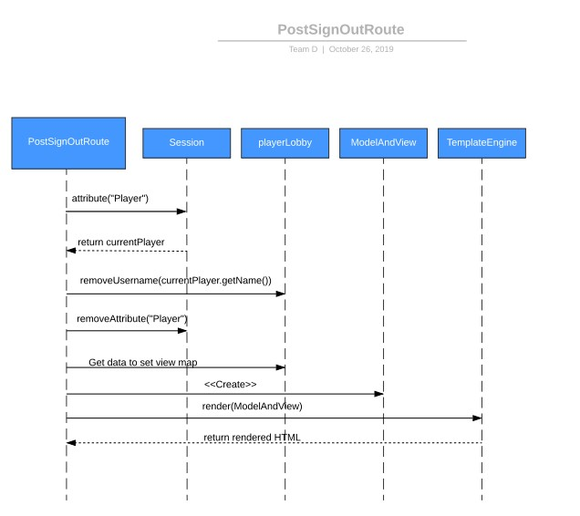

# PROJECT Design Documentation

## Team Information
* Team name: Team D
* Team members
  * Brandon Chen
  * Giovanni Melchionne
  * Kris Schnupp
  * Johnny Puskar
  * Kyle Collins

## Executive Summary

Web Checkers is an online, multiplayer web app that allows users to play checkers with one another.
Users can sign in with a desired username and play against friends or strangers.

### Purpose
Provide a way for users to play checkers with their friends. The target user base would be all checkers lovers.

### Glossary and Acronyms

| Term | Definition |
|------|------------|
| MVP | Minimum Viable Product |

## Requirements
Allow users to Sign In with a username, without Sign Out functionality. 
Allow users to start a game with other online players who are not in a game. 
Allow users to play a game with their opponent. 
Allow users to record and watch replays of any game. 
Allow users to ask for help when they are stuck. 

### Definition of MVP
The MVP of the project is to have a basic checkers game with sign in and sign out functionality.

### MVP Features
The features of the MVP will be sign in with a username and sign out. 
Start a game with a player who is not in a game. 
Resign a game. 
Validate the moves. 
Submit and pass your turn. 

### Roadmap of Enhancements
Allow users to ask for help about available moves. 
Allow users to record the moves in the game and replay them. 

## Application Domain

The main entities are the board, player, piece, moves, and square. 
Pieces belong on the board, and the board is made of squares.  
A Player is represented by a piece and makes moves. 
A Piece can either be a regular piece or king piece. 
The different types of moves are capture, regular move, and king move. 

## Architecture and Design

This section describes the application architecture.

### Summary

The following Tiers/Layers model shows a high-level view of the webapp's architecture.

As a web application, the user interacts with the system using a
browser.  The client-side of the UI is composed of HTML pages with
some minimal CSS for styling the page.  There is also some JavaScript
that has been provided to the team by the architect.

The server-side tiers include the UI Tier that is composed of UI Controllers and Views.
Controllers are built using the Spark framework and View are built using the FreeMarker framework.  The Application and Model tiers are built using plain-old Java objects (POJOs).

Details of the components within these tiers are supplied below.

### Overview of User Interface

This section describes the web interface flow; this is how the user views and interacts
with the WebCheckers application.

After the user connects, the user sees the home page with route "/". After, if he chooses to sign in, he gets sent to the "/signin", seeing the signin.ftl page. After he signs in, he is redirected to the homepage if he inputs a valid name, and if not, he stays on the "/signin" route. If he is signed in, he can choose to start a game which would load the "/game". In a game, the user whose turn it is can move a piece and if it is a valid move, he can submit his turn or backup his turn. Both of these options will make the state stay in "/game". However, the user can resign a game which will send the user back to the "/", home page with the game ending. On the other hand, the user who is waiting for his turn will keep posting "/checkTurn" which will leave the user in the "/game" route, but checks if the it is his turn. Alos, the user can resign the game which will send the user to the "/", home page and his opponent to the "/game" with a new view.

### UI Tier
GetHomeRoute: This route is used to load the home page. The different times this route is called is when the user first connects to the web application, after he signs in and also after his game ends. Renders the "/" route. 

GetSignInRoute: The GetSignInRoute is meant to allow users to choose a username to play as. The route renders the "/signin" route. 

PostSignInRoute: The PostSignInRoute is called from the GetSignInRoute when the user submits a name. The route handles all the invalid user inputs and redirects the user back to home if the name is valid. Upon valid username, the playerLobby is updated. The route renders the "/" home route.  

GetStartGameRoute: GetStartGame is more generally the GetGame Route which allows users to load the game. It can be called when users are on the home page and click on another user's name, or it can be called automatically on refresh when the game has started to update the game as it is played. The route renders the "/game" route.

PostValidateMove: The PostValidateMove Route is used to check if a move a user has made is valid. It checks if a move is a simple move, or if it was a capture move. Based on what the user is done, checks are done to see if the user's turn is over or if there are still pieces the user can capture. The return is an ajax call with a message to the user and whether or not the move was valid or an error. 

PostBackupRoute: The route handles when users try to press the backup button which reverts the board back to the starting state of the user's turn. The return is an ajax call with a message to the user and whether or not the backup was valid. 

PostResignGame: PostResignGame handles the resign game button which should resign the game for the user. The return is an ajax call with a message to the user and whether or not the resign was valid. 

PostSubmitTurn: PostSubmitTurn allows users to submit their turn to the other player. The submit turn should return an ajax call. The ajax call is either a Message.Type.INFO if the turn was able to be submitted and if it is not a valid turn, a Message.Type.ERROR is passed.  

PostCheckTurn: The PostCheckTurn route handles the user who is waiting for his turn. It checks if the game is over and if it is his turn. If it is his turn or the game has ended, it returns a successful ajax call. If he is still waiting for his turn, it returns an error ajax call. 

PostSignOutRoute: The PostSignOutRoute allows the user to signout of the web application and removes him from the lobby. This route renders the home page. 

WebServer: The WebServer handles all of the HTTP requests and creates the appropriate route with the correct parameters for each. 

### Application Tier_
 Our application has the PlayerLobby and Game.   
 PlayerLobby holds all the Players that are currently logged in and is changed by SignIn and SignOut.  
 Game holds the game of checkers 2 players are playing and other necessary information like what happened during a specific turn  

### Model Tier
Our Model Tier has Board, Move, Piece, Player, Position, Row, and Space 
Board holds the logic for containing a set of Rows and updating specific Spaces with Pieces  
Row holds 8 Spaces  
Space is a square that has a color, and the Black Tiles can have a Piece  
Piece has a Color (Red or White) and a type (Single or King)  
Position is the row and space coordinate of a place on the board  
Move is 2 positions that represent a starting and ending point of a piece during a move  

### Utilities Tier
Our Utilities includes Message, MoveValidator, and ValidationResult
ValidationResult are the enums that MoveValidator returns  
MoveValidator is something that takes model components and returns a value for the UI to use to determine what to do with the information given  
Message is used to make messages to send to the JavaScript and display on the screen  
### Design Improvements
What we Improved: we originally didn't have board hold a list of Rows and instead had it hold a double array of Spaces.  
we updated our Board to hold a list of rows that held a list of spaces to better fit Object-Oriented Design. 

What we could improve on:  
Our code for validating moves is very convoluted and complex and could be nicer and easier to follow. 
More simpler methods- specifically RevertTurn() and SubmitTurn() needs variables we have in game that game doesn't use for anything else 
We could have combined all of those variables into one class called Turn to simplify these methods 

Tedious Checks: some of our methods are very tedious and run a ton of lines of code to check if something is valid, or to get the proper information  
These could be simplified so when unit testing they aren't extremely hard to test   

## Testing
The tests that we performed involved unit testing to see if our code would return the 
expected outcome given any input. Also, acceptance testing was done manually to see if 
the logic of the game was correct and to catch any bugs that could occur. 

### Acceptance Testing
Acceptance testing was done manually by someone who did not write the code to test the logic of the 
program. All of our user stories have passed the suite of acceptance criteria tests. We have nto yet tested 
any of the enhancement user stories. Some of the issues we found included random bugs in the game logic such 
as moving backwards when the piece was not a king and being able to end your turn even with an available capture.

### Unit Testing and Code Coverage
Our overall code... 
Some of our unit tests were purposely not tested as they required tedious checks. For exmaple, we 
did not check the case where the game would end if a user no longer had any places to move with his pieces. We thought that 
this was an extreme condition that was hard to test with a unit test, but instead tested it manually for the expected outcome.

