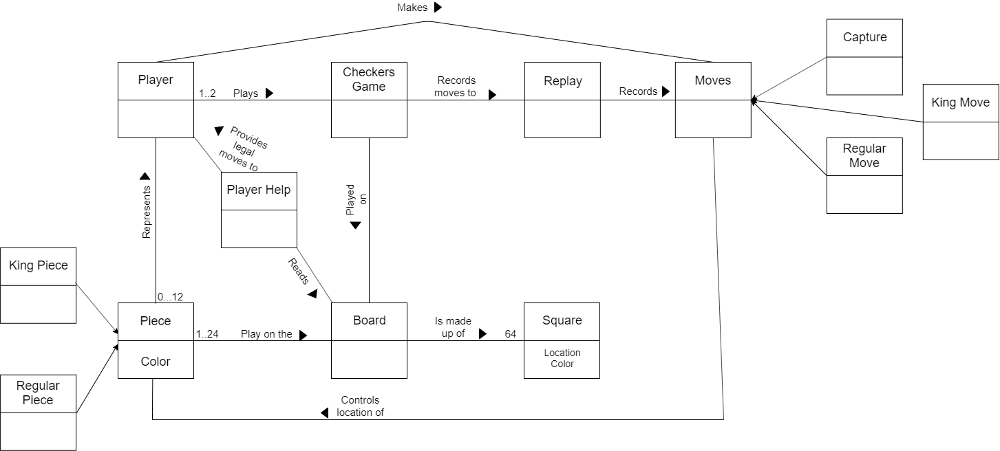
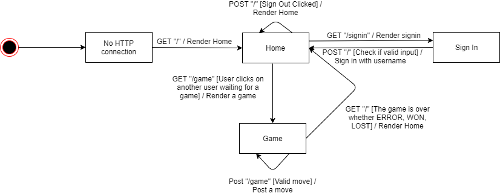

# PROJECT Design Documentation

## Team Information
* Team name: Team D
* Team members
  * Brandon Chen
  * Giovanni Melchionne
  * Kris Schnupp
  * Johnny Puskar
  * Kyle Collins

## Executive Summary

Web Checkers is an online, multiplayer web app that allows users to play checkers with one another.
Users can sign in with a desired username and play against friends or strangers.

### Purpose
Provide a way for users to play checkers with their friends. The target user base would be all checkers lovers.

### Glossary and Acronyms
> _Provide a table of terms and acronyms._

| Term | Definition |
|------|------------|
| VO | Value Object |

## Requirements
Allow users to Sign In with a username, without Sign Out functionality. 
Allow users to start a game with other online players who are not in a game. 
Allow users to play a game with their opponent. 
Allow users to record and watch replays of any game. 
Allow users to ask for help when they are stuck. 

### Definition of MVP
The MVP of the project is to have a basic checkers game with sign in and sign out functionality.

### MVP Features
The features of the MVP will be sign in with a username and sign out. 
Start a game with a player who is not in a game. 
Resign a game. 
Validate the moves. 
Submit and pass your turn. 

### Roadmap of Enhancements
Allow users to ask for help about available moves. 
Allow users to record the moves in the game and replay them. 

## Application Domain

The main entities are the board, player, piece, moves, and square. 
Pieces belong on the board, and the board is made of squares.  
A Player is represented by a piece and makes moves. 
A Piece can either be a regular piece or king piece. 
The different types of moves are capture, regular move, and king move. 

## Architecture and Design

This section describes the application architecture.

### Summary

The following Tiers/Layers model shows a high-level view of the webapp's architecture.

As a web application, the user interacts with the system using a
browser.  The client-side of the UI is composed of HTML pages with
some minimal CSS for styling the page.  There is also some JavaScript
that has been provided to the team by the architect.

The server-side tiers include the UI Tier that is composed of UI Controllers and Views.
Controllers are built using the Spark framework and View are built using the FreeMarker framework.  The Application and Model tiers are built using plain-old Java objects (POJOs).

Details of the components within these tiers are supplied below.

### Overview of User Interface

This section describes the web interface flow; this is how the user views and interacts
with the WebCheckers application.

After the user connects, the user sees the home page with route "/". After, if he chooses to sign in, he gets sent to the "/signin", seeing the signin.ftl page. After he signs in, he is redirected to the homepage if he inputs a valid name, and if not, he stays on the "/signin" route. If he is signed in, he can choose to start a game which would load the "/game".

### UI Tier
> _Provide a summary of the Server-side UI tier of your architecture.
> Describe the types of components in the tier and describe their
> responsibilities.  This should be a narrative description, i.e. it has
> a flow or "story line" that the reader can follow._

> _At appropriate places as part of this narrative provide one or more
> static models (UML class structure or object diagrams) with some
> details such as critical attributes and methods._

> _You must also provide any dynamic models, such as statechart and
> sequence diagrams, as is relevant to a particular aspect of the design
> that you are describing.  For example, in WebCheckers you might create
> a sequence diagram of the `POST /validateMove` HTTP request processing
> or you might show a statechart diagram if the Game component uses a
> state machine to manage the game._

> _If a dynamic model, such as a statechart describes a feature that is
> not mostly in this tier and cuts across multiple tiers, you can
> consider placing the narrative description of that feature in a
> separate section for describing significant features. Place this after
> you describe the design of the three tiers._

### Application Tier_
   Our application has the PlayerLobby and Game.   
 PlayerLobby holds all the Players that are currently logged in and is changed by SignIn and SignOut.  
 Game holds the game of checkers 2 players are playing and other necessary information like what happened during a specific turn  

### Model Tier
Our Model Tier has Board, Move, Piece, Player, Position, Row, and Space 
Board holds the logic for containing a set of Rows and updating specific Spaces with Pieces  
Row holds 8 Spaces  
Space is a square that has a color, and the Black Tiles can have a Piece  
Piece has a Color (Red or White) and a type (Single or King)  
Position is the row and space coordinate of a place on the board  
Move is 2 positions that represent a starting and ending point of a piece during a move  
### Design Improvements
> _Discuss design improvements that you would make if the project were
> to continue. These improvement should be based on your direct
> analysis of where there are problems in the code base which could be
> addressed with design changes, and describe those suggested design
> improvements. After completion of the Code metrics exercise, you
> will also discuss the resutling metric measurements.  Indicate the
> hot spots the metrics identified in your code base, and your
> suggested design improvements to address those hot spots._

## Testing
> _This section will provide information about the testing performed
> and the results of the testing._

### Acceptance Testing
> _Report on the number of user stories that have passed all their
> acceptance criteria tests, the number that have some acceptance
> criteria tests failing, and the number of user stories that
> have not had any testing yet. Highlight the issues found during
> acceptance testing and if there are any concerns._

### Unit Testing and Code Coverage
> _Discuss your unit testing strategy. Report on the code coverage
> achieved from unit testing of the code base. Discuss the team's
> coverage targets, why you selected those values, and how well your
> code coverage met your targets. If there are any anomalies, discuss
> those._
